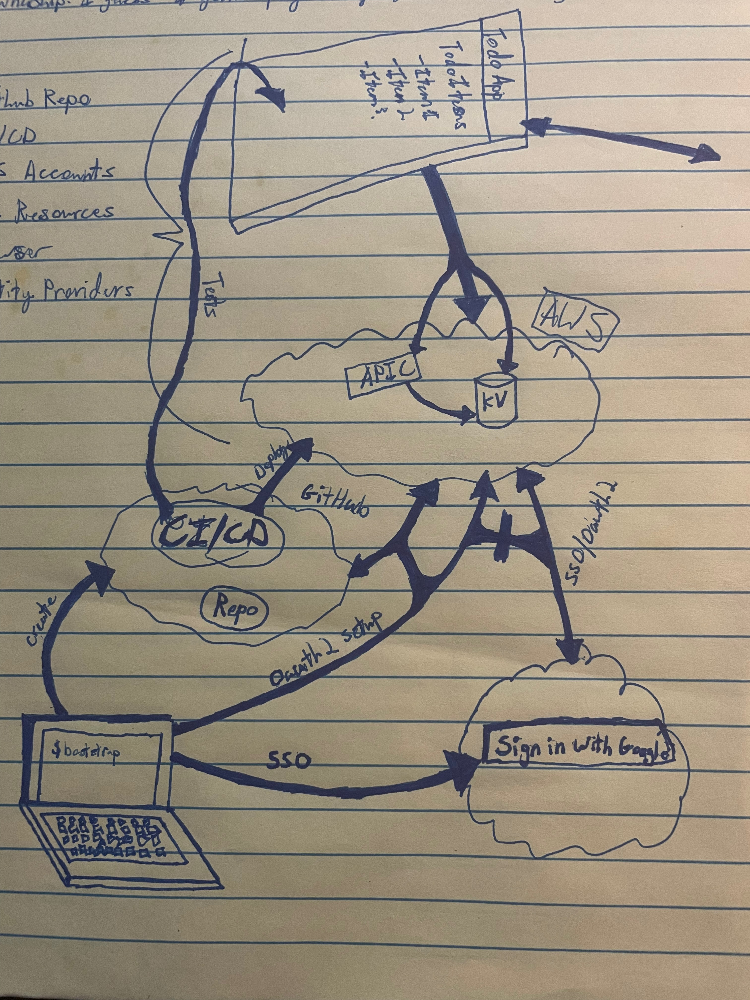
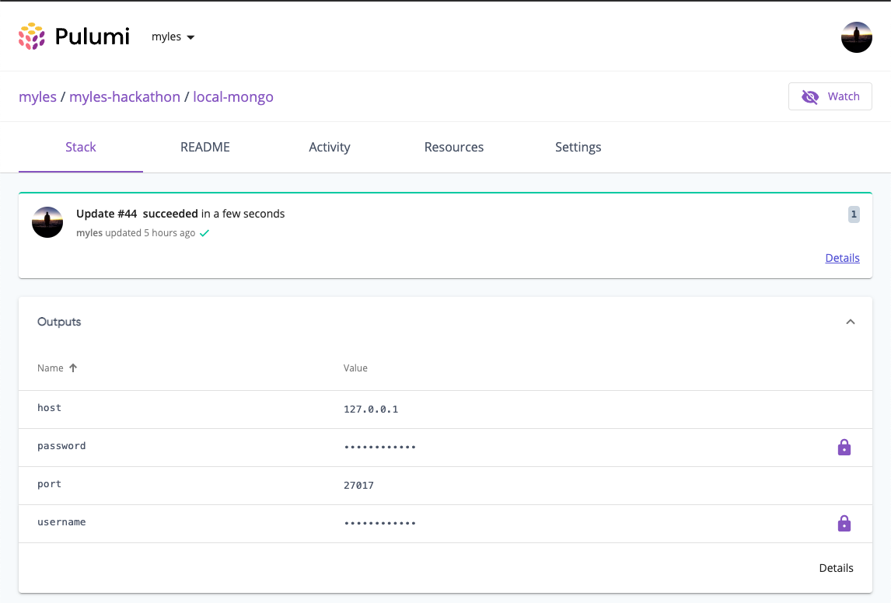

# Bootstrap GitHub & AWS with Pulumi

> Warning: This repo is full of bugs because this is a hackathon and I spent too much time on playing with function serialization and not enough on the bootstrap experience


This repo is a proof of concept a question I wanted to explore:

> Can you define and create your infrastructure in the same place you use it?

> What would it look like if you did it that way? How would it work?


## Motivation

An application isn't just a single thing. Its comprised of many different things all at once. The lines between apps is getting increasingly blurry. Where does the application end and the "infrastructure" begin? Is the database "part" of an application?


Here's a janky drawing I made that I think highlights what I'm talking about (ignore the arrow to nowhere): 




### Code Rot
Additionally, when we treat our infrastructure separately from our application, the infrastructure gets treated like a second class citizen. We should treat it like the first class citizen it is.

There's a great [comment on a hacker news thread](https://news.ycombinator.com/item?id=31394224) about this:

> The “code” rot creeps in over the years. Especially so if you work with a lot of people on the team. If they view the infrastructure-as-“code” parts of the project as somehow lesser in stature than the rest of the actual code, then they more than likely see the YAML as a legitimate place to make drive-by tweaks without much care for “code” quality.


So what if the infrastructure-as-code was just your regular application code? Do they have to be different?


### Another Goal: Minimize Copy Paste
 Executive Dysfunction is a real thing and I cannot execute more than like 2 steps at a time. Every time I copy paste something I get scared. I don't want to be scared when I'm linking up my application with my infrastructure. As I was developing this application, I didn't need to duplicate where I was defining a configuration key once.

## Concept: `WHOAMI`
`WHOAMI` is an environment variable that determines "who" this application is. When we run `node ./bin/index.js`, we supply `WHOAMI` so that the application knows what its job is. 

### I am: `root`
All operations that I would consider `sudo` operations for cloud resources happen as root. This includes initial setup and managing permissions at a level above a single instance of the application


### I am: `mchaynes-laptop`
This is live application that runs on my laptop. It uses `LocalDockerMongo` as its mongo db instance and uses `ExpressServer` to run the API.

### I am: `github-actions-mchaynes`
Environment/Branch/App specific github-action role. This incarnation of the app runs `bootstraps` then bails out. It does not run forever

# What does this proof of concept do?

This repo uses Pulumi's Automation API to test out the idea. And along the way, sets up a pretty nice developer experience for anyone who wants to safely ship software to users

This is the setup process to have an entire CI/CD workflow executed through GitHub actions all the way to AWS: 

```sh
$ git clone git@github.com:mchaynes/pulumi-bootstrap.git && cd ./pulumi-bootstrap

# deps: brew install aws && brew tap jaxxstorm/tap && brew install aws-sso-creds 
$ aws sso login && eval $(aws-sso-env export --profile <aws-profile-name>)

# deps: brew install gh yq && gh auth login
$ export GITHUB_TOKEN=$(yq -r '.["github.com"].oauth_token' ~/.config/gh/hosts.yml)

# deps: brew install pulumi
$ pulumi login

# deps: brew install nvm && nvm install v18 && nvm use v18 && npm i -g yarn
$ export WHOAMI=root; yarn && yarn run tsc && yarn node ./bin/index.js

```
## Tada! You now have:

1. A GitHub repo + actions that has permissions to your AWS account
1. `API Gateway` --> `Lambda` --> `MongoDb (DocumentDb)` stack running in AWS
1. A couple of Pulumi stacks under a project called "pulumi-hackathon"
1. A local developer environment that uses `docker-compose` to spin up a local mongodb instance
1. A unit & integration testable developer experience where all "infrastructure" is injected into your "business logic"


# That's nice, but isn't that just a regular Pulumi program? 

Yep, absolutely. While I do think Lee Brigg's OIDC `secure-cloud-access` repo is particularly nice, its not unusual.


The thing that's new or interesting about this application is what the code looks like. It tries to integrate all of those different pieces of an "application". Lets take a peek into `index.ts`. This is how we define an application in all of its various incarnations:

```typescript

/**
 * Github Collaborators of on this app
 * They all get their own branch and deployment
 */
export const collaborators = {
    "mchaynes": { permission: "admin" },
    "stevesloka": { permission: "admin" },
    "djgrove": { permission: "admin" },
    "caseyyh": { permission: "admin" },
    "EvanBoyle": { permission: "admin" },
};

/**
 * The "live" environments
 */
export const environments = {
    "dev": {},
    "stage": {},
    "prod": {}
};

/**
 * What is an app, really?
 * Does the definition of an "app" include its infrastructure as well?
 */
export type App = {
    /*
    * bootstraps are any actions that should run before the app starts up that the "live" app
    * doesn't directly depend on in the code.
    * Things like github branch setup, rewriting the readme, etc should all live there
    */
    bootstraps?: (() => Promise<any>)[];
    /**
     * Some apps aren't long for this world. These apps are typically "CI/CD" apps
     */
    bailAfterBootstrap?: boolean;

    // Everything below is specific to the live running application.
    // These functions describe how to grab their various dependencies so that they can
    // be injected into the application

    /**
     * mongo function is responsible for getting a connection to a mongo server somehow
     */
    mongo?: () => Promise<MongoClient>;

    /**
     * listen function is the final piece of main. If defined, it stops the app from exiting so that
     * the server can listen for requests and basically just do its job
     */
    listen?: (mongo: MongoClient) => Promise<void>;
};

let apps: Apps = {
    // The "root" app is for operations that manage all of the other apps.
    // This app typically handles permission management at a level higher than a single 'environment'
    // Like giving a new user access, or giving an AWS account permissions to GitHub
    // Usually this app would be ran manually by an admin, or in a "master" or "post-prod" branch
    // its also the first app that gets run when the application boots up (i.e. when you first cloned it)
    "root": {
        bootstraps: [
            async () => {
                // ensure github repo is created, and that all collaborators have been added to repo
                await Repo.up(repoName, { owner: repoOwner, collaborators: collaborators });
                // initialize connection from github to aws. TODO: add other aws accounts for stage/dev/prod 
                await GithubToAwsAuth.up("dev-account", { repoName: repoName, repoOwner: repoOwner });
                await Branch.up("main", {owner: repoOwner, repoName: repoName, whoami: "root"})
            }
        ],
        // root just grants or builds things then exits. It doesn't serve any live traffic
        bailAfterBootstrap: true,
    },
    // laptop apps run on a laptop
    ...laptopApps(repoOwner, repoName, collaborators),
    // apps that run in github actions
    ...githubActionApps([...Object.keys(collaborators), ...Object.keys(environments)]),
};
```

So that's the top level configuration for the app. Its how we codify what this app is, the various ways in which it should run, etc.

Did you notice the line:
```typescript
// ensure github repo is created, and that all collaborators have been added to repo
await Repo.up(repoName, { owner: repoOwner, collaborators: collaborators });
```

That's the code that adds users to our repo. When a new team mate joins the team, we just add them to the `collaborators` object, merge to master (which runs the `root` application in a github action), and we're off to the races


This is the rest of the `run` or `main` function:
```typescript
const run = async () => {

    // who am i? where am i running? what is my purpose?
    const whoami = process.env[EnvVars.WHOAMI];

    console.log(`Available App Names: [${Object.keys(apps).join(", ")}]`);

    if (!whoami) {
        throw new Error(`Please set ${EnvVars.WHOAMI} environment variable.`);
    }

    console.log(`Running as: ${whoami}`);

    if (!(whoami in apps)) {
        throw new Error(`You are ${whoami}, but you aren't a valid app. You probably need to add yourself to index.ts`);
    }

    // get config for this app
    const config = apps[whoami as keyof typeof apps];

    // init any "bootstrap" actions
    // "bootstraps" are any functions that should run that the "live" application doesn't depend on. 
    // basically: go do some work to make sure something is set up that we don't directly reference
    // in this application.
    // for CI/CD runs, this is the only thing we actually execute
    if (config.bootstraps) {
        for (let bootstrap of config.bootstraps) {
            await bootstrap();
        }
    }

    if (config.bailAfterBootstrap) {
        console.log(`\n\nI, ${whoami}, am bailing out after successful bootstrap\n\n`);
        process.exit(0);
    }

    if (!config.mongo) {
        throw new Error("this app's config doesn't have a mongo connection");
    }

    const mongoClient = await app.mongo();

    if(app.listen) {
        await app.listen(mongoClient)
    }
}

run().catch(err => console.error(err));
```

This is our "laptop" application:
```typescript
{
    bootstraps: [
        // when we run locally, ensure that github actions and our deploy branch is up to date
        async () => await Branch.up(user, { owner: repoOwner, repoName: repoName, whoami: `github-actions-${user}` }),
    ],
    // make sure that mongo is up and running
    mongo: async () => await LocalDockerMongo.up(`local-mongo`),
    listen: async (mongo: MongoClient) => await ExpressServer.up(mongo)
}
```

Going back up to our `run()` function above, did you notice this piece?

```typescript
const mongoClient = await app.mongo();

if(app.listen) {
    await app.listen(mongoClient)
}
```
This is where we're actually _injecting_ the infrastructure into our application. In the `laptop` class of applications, we've taken the result of a `LocalDockerMongo.up()` and injected that into `ExpressServer.up()`. At the same time, we've also abstracted away any mention of what the infrastucture is.

All of this can be as complex or as not complex as you want it to be. I've chosen to go pretty basic here, but these principles apply to any mix of infrastructure and application code


## Now here's where things get a little weird.

There's all these "apps" defined in index.ts, but there's no `live` app or `AWS` app? Where's the prod application?

I decided to deploy this application to AWS via a "serverless" approach. Mainly because I wanted to try out [function serialization](https://www.pulumi.com/docs/intro/concepts/function-serialization/) with Pulumi. I didn't have to do it this way, I very easily could've used my `ExpressServer` implementation combined with ECS to run it.

Because I went with a serverless approach, the `github-actions` app is the final stop for the root entrypoint for this application. The rest of the application is torn up and shipped off to Lambda behind API Gateway. With injected config, of course.

To do this, and to share the business logic between `ExpressServer` and `ApiGwServer`, I ended up defining an http handler that's basically just like any other one you've seen:

```typescript
class Server {
    static routes(getClient: () => Promise<MongoClient>): Routes {
        return {
            "/users": {
                "GET": async (req) => {
                    const mongoClient = await getClient()
                    const users = mongoClient.db("db").collection("users")
                    const id = req.params["id"];
                    const result = await users.findOne({
                        _id: new ObjectId(id),
                    });

                    if (!result) {
                        return {
                            statusCode: 404,
                            body: "not found",
                        }
                    }
                    return {
                        statusCode: 200,
                        body: result,
                    }
                }
            }
        }
    }
}
```

That `getClient` dependency in `routes()` is injected in our github-action app:

```typescript
{
    bootstraps: [
        async () => {
            const outputs = await DocDb.up(`docdb-${env}`)
            await ApiGwServer.up(`apigw-${env}`, outputs)
        }
    ],
    // github actions are CI/CD processes, so they should just bootstrap then exit
    bailAfterBootstrap: true,
}
```

And those functions are shipped off to Lambda in `ApiGwServer.up()`:

```typescript
for (let [path, methods] of Object.entries(routes)) {
    for (let [method, handler] of Object.entries(methods)) {
        switch(method) {
            case "GET":
            case "POST":
                apiGwRoutes.push({
                    path: path,
                    method: method,
                    
                    eventHandler: new aws.lambda.CallbackFunction(`${path.replace(/\//, "")}-${method}`, {
                        memorySize: 256,
                        runtime: "nodejs16.x", 
                        callback: async (event: awsx.apigateway.Request)  => {
                            const response = await handler({
                                headers: event.headers as Record<string, string>,
                                params: event.queryStringParameters as Record<string,string>,
                                body: event.body || "",
                            })
                            return {
                                statusCode: response.statusCode,
                                body: response.body,
                            }
                        }
                    })
                })
        }
    }
}
```

# What do these `up` functions look like under the hood?

My favorite part. I have a bunch of "micro" stacks for this. The application "depends" on a bunch of stacks. From reading the code above, you can probably tell what's going on. Each dependency comprises its own stack. Of course, it doesn't "have" to comprise its own stack, but I wanted to lean into pure dependency injection territory as much as I can

This is what the `DocDb` class looks like:

```typescript
export class DocDb {
    static program(stackName: string) {
        return async () => {
            const password = new random.RandomPassword("password", {
                length: 8,
            })
            const username = new random.RandomString("username", {
                length: 10,
                special: false,
            })
            const docdb = new aws.docdb.Cluster("docdb", {
                backupRetentionPeriod: 5,
                clusterIdentifier: `${stackName}`,
                engine: "docdb",
                masterPassword: password.result,
                masterUsername: username.result,
                preferredBackupWindow: "07:00-09:00",
                skipFinalSnapshot: true,
            });
    
            const output: MongoUpOutputs = {
                username: docdb.masterUsername,
                password: password.result,
                host: docdb.endpoint,
                port: docdb.port.apply(n => `${n}`),
            }
            return output
        }
    }
    static async up(stackName: string): Promise<MongoUpOutputs>  {
        return await Pulumi.up(stackName, DocDb.program(stackName))
    }
}
```

The `Pulumi.up` convenience function is just a wrapper around `LocalWorkspace`. Its not particularly interesting but it does provider typing on output properties, which is really nice.

> Note: I define `program` separately here so we can add `Pulumi.destroy` and `Pulumi.preview()` functions


# Pulumi Service Specific Niceness

Even when spinning up my local docker instance, I was able to store the configuration of my local inside of the pulumi service, and get a history of the running application. This means that I never need a `.env` file. It also means that I can view what failed and when and how, long after my shell history is gone.



